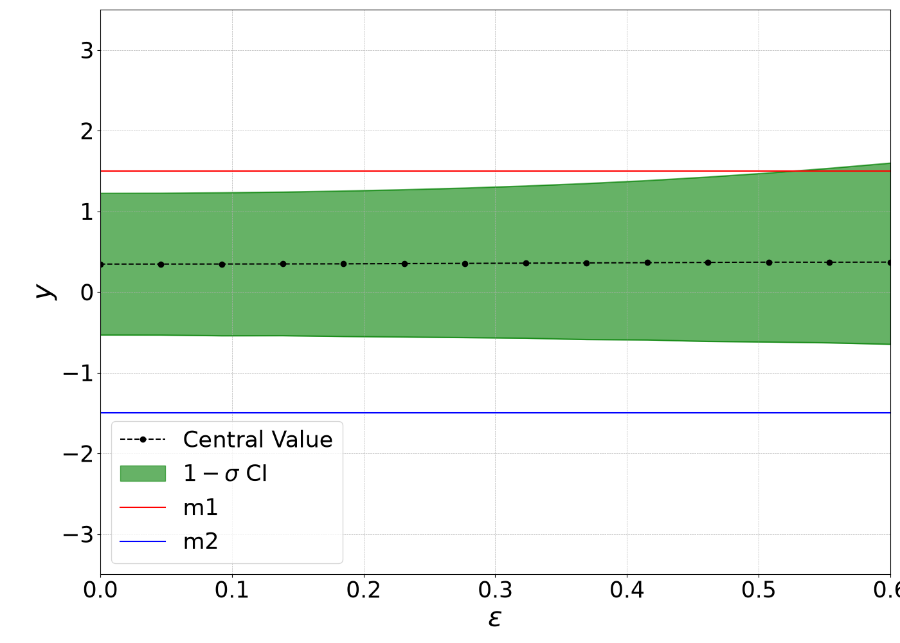
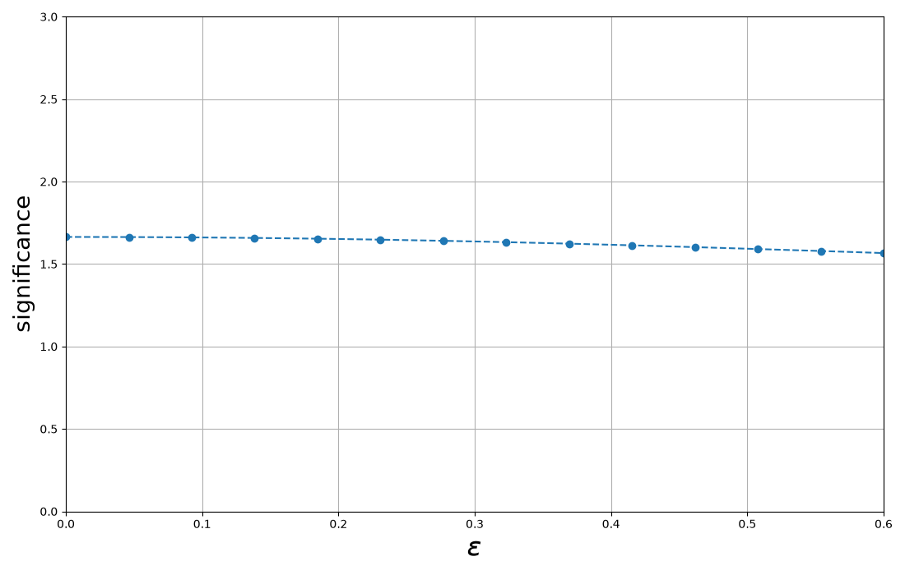
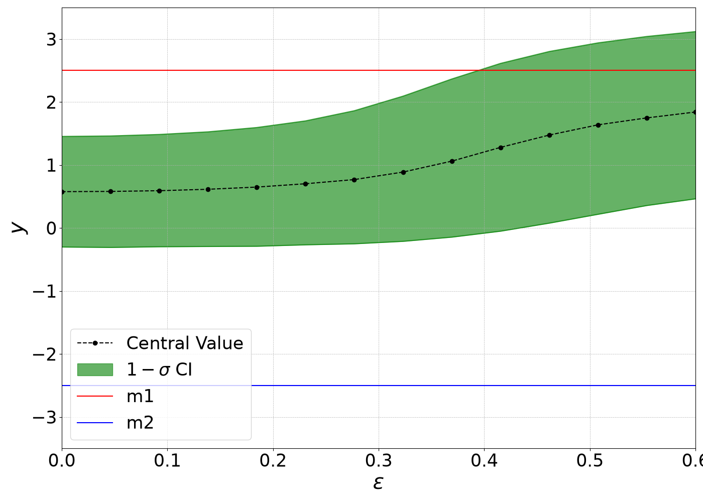
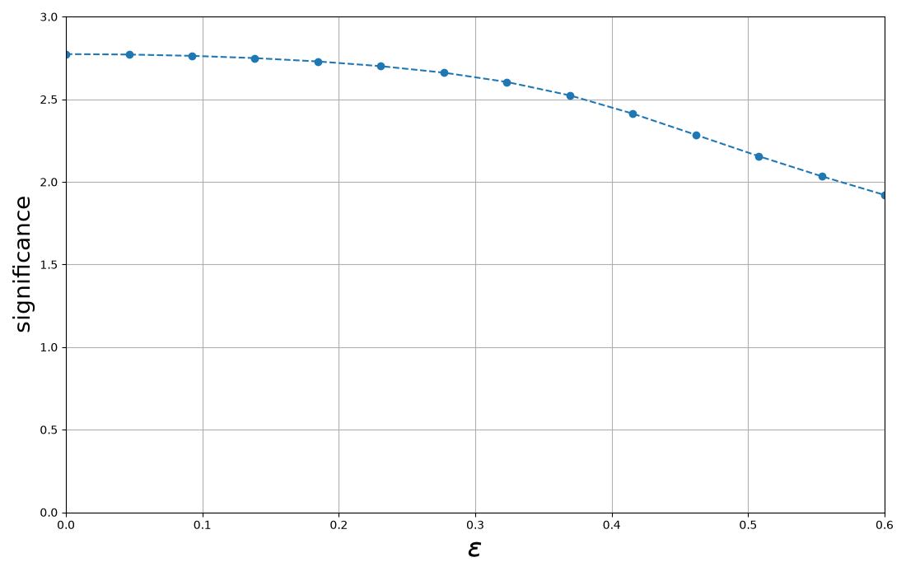
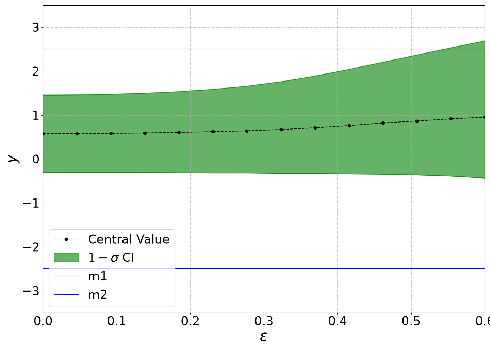
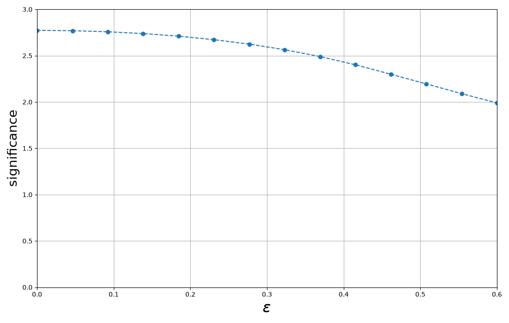
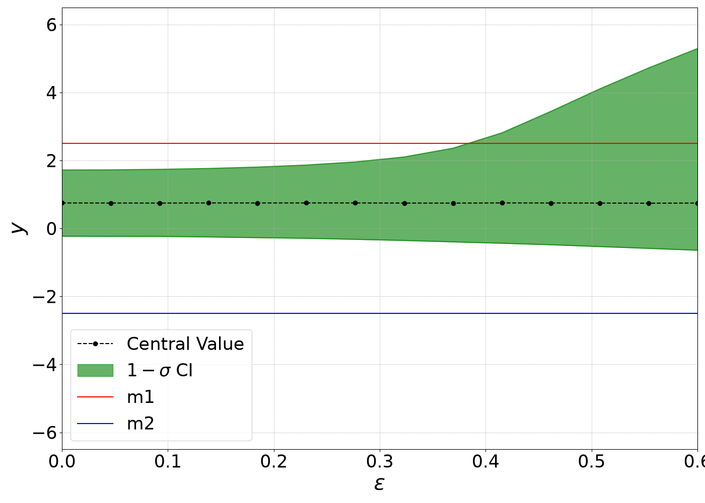
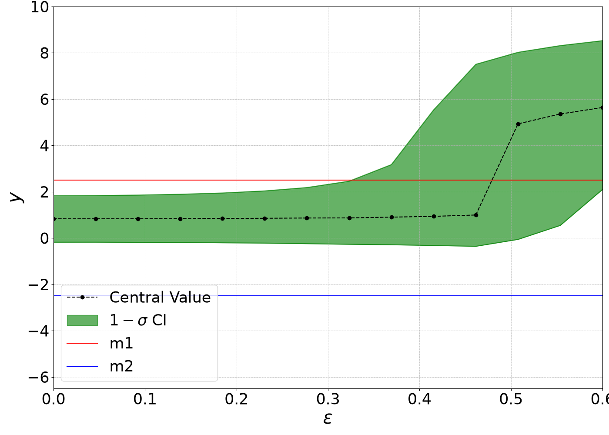
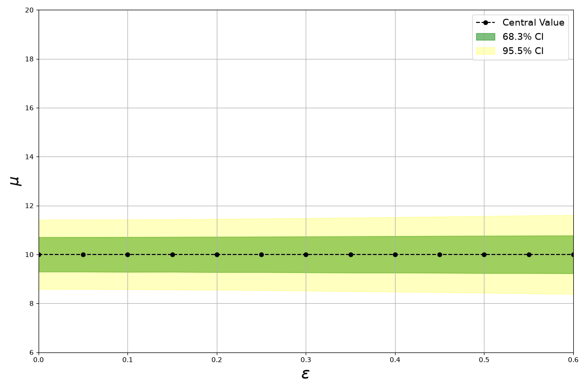
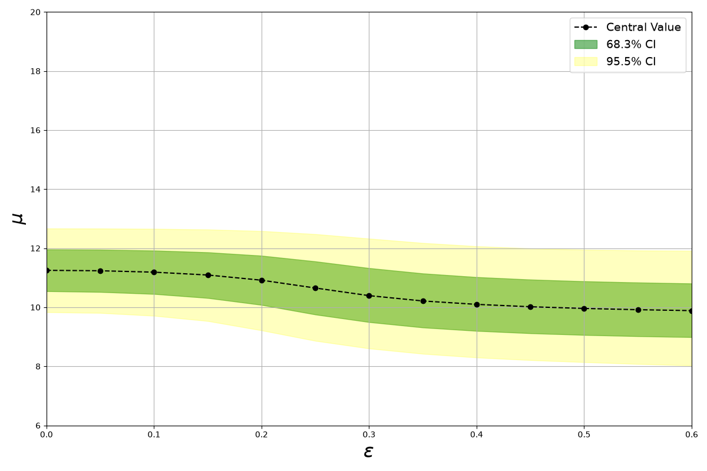

# Toy Correlation Tutorial

In this notebook, we demonstrate how to use the toolkit to implement errors-on-error in a combination scenario, under different correlation assumptions.

In the first part of this tutorial, we focus on a simple combination of two measurements. Both measurements estimate the same physical quantity, with central values \( y_1 = 1.5 \) and \( y_2 = -1.5 \), and statistical uncertainties \( \sigma_{y_1} = \sigma_{y_2} = 1 \). We introduce a single systematic source with magnitudes \( \Gamma_1 = 0.5 \) and \( \Gamma_2 = 1 \), such that the first measurement carries a smaller total uncertainty.

We begin by setting all error-on-error terms to zero, so that only the correlation structure influences the result. We then show how to introduce and incorporate the effect of errors-on-error in the combination.


```python
import os, sys
import numpy as np
import matplotlib.pyplot as plt
from scipy.stats import chi2, norm
from copy import deepcopy

script_dir = os.getcwd()
gvm_root = os.path.abspath(os.path.join(script_dir, "../../"))
if gvm_root not in sys.path:
    sys.path.insert(0, gvm_root)

from gvm import GVMCombination
from gvm import build_input_data
```

# No errors-on-errors

## 1. Systematic correlation examples

We now compare three different correlation matrices for the systematic uncertainty:
1. **Diagonal**: off-diagonal terms are zero so the systematic acts independently.
2. **Hybrid**: the off-diagonal coefficient is 0.75 representing a partial correlation.
3. **Fully correlated**: all coefficients are one so the systematic behaves as one shared nuisance parameter.

In the configuration file, errors-on-error are explicitly set to zero, and their type is set to *dependent*. In principle, one could omit both the error-on-error value and its type, since the defaults are zero and *dependent*, respectively. Note that the systematic type is irrelevant when the error-on-error is zero.

### Diagonal

    global:
      name: diag_corr
      n_meas: 2
      n_syst: 1

    data:
      measurements:
        - label: m1
          central: 1.5
          stat_error: 1.0
        - label: m2
          central: -1.5
          stat_error: 1.0

    syst:
      - name: sys1
        shift:
          value: [0.5, 1.0]
          correlation: diagonal
        error-on-error:
          value: 0.0
          type: dependent

The `diagonal` option corresponds to:

```
1 0
0 1
```

```python
data = build_input_data('input_files/diag_corr.yaml')
comb = GVMCombination(data)
comb.fit()
mu_hat = comb.fit_results.mu
ci_low, ci_high, _ = comb.confidence_interval()
chi_2 = comb.goodness_of_fit()
p_value = 1 - chi2.cdf(chi_2, df=1)
significance = norm.ppf(1 - p_value/2)
print(f'mu_hat = {mu_hat:.4f}, CI = ({ci_low:.4f}, {ci_high:.4f})')
print(f'χ² = {chi_2:.3f}, significance = {significance} \n')
```

    mu_hat = 0.3462, CI = (-0.5332, 1.2230)
    χ² = 2.769, significance = 1.6641005886756863

### Hybrid correlation


    global:
      name: hybrid_corr
      n_meas: 2
      n_syst: 1
      matrix_dir: correlations

    data:
      measurements:
        - label: m1
          central: 1.5
          stat_error: 1.0
        - label: m2
          central: -1.5
          stat_error: 1.0

    syst:
      - name: sys1
        shift:
          value: [0.5, 1.0]
          correlation: hybrid_corr.txt
        error-on-error:
          value: 0.0
          type: dependent

`hybrid_corr.txt`

```
1 0.75
0.75 1
```

```python
data = build_input_data('input_files/hybrid_corr.yaml')
comb = GVMCombination(data)
comb.fit()
mu_hat = comb.fit_results.mu
ci_low, ci_high, _ = comb.confidence_interval()
chi_2 = comb.goodness_of_fit()
p_value = 1 - chi2.cdf(chi_2, df=1)
significance = norm.ppf(1 - p_value/2)
print(f'mu_hat = {mu_hat:.4f}, CI = ({ci_low:.4f}, {ci_high:.4f})')
print(f'χ² = {chi_2:.3f}, significance = {significance} \n')
```

    mu_hat = 0.4500, CI = (-0.5288, 1.4212)
    χ² = 3.600, significance = 1.8973665961010266

### Fully correlated

    global:
      name: full_corr
      n_meas: 2
      n_syst: 1

    data:
      measurements:
        - label: m1
          central: 1.5
          stat_error: 1.0
        - label: m2
          central: -1.5
          stat_error: 1.0

    syst:
      - name: sys1
        shift:
          value: [0.5, 1.0]
          correlation: ones
        error-on-error:
          value: 0.0
          type: dependent

The `ones` option corresponds to:

```
1 1
1 1
```

```python
data = build_input_data('input_files/full_corr.yaml')
comb = GVMCombination(data)
comb.fit()
mu_hat = comb.fit_results.mu
ci_low, ci_high, _ = comb.confidence_interval()
chi_2 = comb.goodness_of_fit()
p_value = 1 - chi2.cdf(chi_2, df=1)
significance = norm.ppf(1 - p_value/2)
print(f'mu_hat = {mu_hat:.4f}, CI = ({ci_low:.4f}, {ci_high:.4f})')
print(f'χ² = {chi_2:.3f}, significance = {significance}')
```

    mu_hat = 0.5000, CI = (-0.5000, 1.5003)
    χ² = 4.000, significance = 1.999999999999998


## 2. Non-diagonal statistical covariance
The same systematic is fully correlated as above, but this time the statistical uncertainties are specified via a covariance matrix that includes non-zero off-diagonal terms.

Unlike systematic uncertainties — which can be described through correlation matrices — statistical uncertainties must be provided directly as a **covariance matrix**.

    global:
      name: stat_cov
      n_meas: 2
      n_syst: 1
      matrix_dir: correlations

    data:
      stat_cov_path: stat_cov.txt
      measurements:
        - label: m1
          central: 1.5
        - label: m2
          central: -1.5

    syst:
      - name: sys1
        shift:
          value: [0.5, 1.0]
          correlation: ones
        error-on-error:
          value: 0.0
          type: dependent

`stat_cov.txt`

```
2 1
1 2
```

The `ones` option corresponds to:

```
1 1
1 1
```

```python
data = build_input_data('input_files/stat_cov.yaml')
comb = GVMCombination(data)
comb.fit()
mu_hat = comb.fit_results.mu
ci_low, ci_high, _ = comb.confidence_interval()
chi_2 = comb.goodness_of_fit()
p_value = 1 - chi2.cdf(chi_2, df=1)
significance = norm.ppf(1 - p_value/2)
print(f'mu_hat = {mu_hat:.4f}, CI = ({ci_low:.4f}, {ci_high:.4f})')
print(f'χ² = {chi_2:.3f}, significance = {significance}')
```

    mu_hat = 0.5000, CI = (-0.9187, 1.9138)
    χ² = 4.000, significance = 1.999999999999998

## 3. Tip: modifying the combination
You can obtain the current input with `get_input_data(copy=True)` and modify the returned dictionary.
After editing, pass it to `set_input_data()` to apply the changes before refitting.

```python
data = build_input_data('input_files/diag_corr.yaml')
comb = GVMCombination(data)
info = comb.get_input_data(copy=True)
info.measurements['m1'] = 2.0
i = info.labels.index('m1')
info.syst['sys1'][i] = 0.5
info.eoe_type['sys1'] = 'dependent'
info.corr['sys1'] = np.array([[1.0, 0.3], [0.3, 1.0]])
```

```python
info.corr['sys1']
```

    [[1.  0.3]
     [0.3 1. ]]

```python
comb.set_input_data(info)
comb.fit()
print(f"updated mu_hat={comb.fit_results.mu:.4f}")
```

    updated mu_hat=0.6949


# Effect of error-on-error

We now vary the error-on-error parameter ($\varepsilon$) from 0 to 0.6 to illustrate how the combination results depend on its value. When errors-on-errors are nonzero, the distinction between *independent* and *dependent* systematics becomes relevant and affects the outcome of the combination.

- When a systematic effect is **independent**, the estimates of the systematic uncertainties for the measurements in the combination are statistically independent. This means that the systematic uncertainty for measurement *m1* could be overestimated while *m2* is underestimated, or vice versa — both estimates can fluctuate independently. This also implies that the correlation matrix of the corresponding nuisance parameters must be diagonal. If a non-diagonal correlation matrix is provided, the toolkit will raise an error.

- When a systematic effect is **dependent**, the estimates of the systematic uncertainties are statistically dependent. In this case, if one estimate is overestimated, the other must be as well, and vice versa. This situation may arise, for example, when uncorrelated systematic effects are estimated using similar techniques. A typical LHC example is a two-point systematic derived from comparing HERWIG and PYTHIA. When the **dependent** type is used, an arbitrary correlation matrix can be provided for the given systematic.

More details on how to implement errors-on-errors in combinations can be found in Sec. 3 of [arXiv:2407.05322](https://arxiv.org/abs/2407.05322), with a more in-depth explanation of dependent vs. independent assumptions in Sec. 3.2.

## 1. Independent systematic
 

### Compatible Measurements
Here, we reinitialize the combination using the configuration file `diag_corr.yaml` as a starting point. In the first example, we examine how the results change when the input measurements are compatible. The systematic type must be changed to *independent*, since the configuration file sets it to *dependent*.


```python
eps_grid = np.linspace(0., 0.6, 14)
data = build_input_data('input_files/diag_corr.yaml')

comb = GVMCombination(data)

base_info = comb.get_input_data(copy=True)

y_1 = base_info.measurements['m1']
y_2 = base_info.measurements['m2']
base_info.eoe_type['sys1'] = 'independent'

comb.set_input_data(base_info)

cv = []
lower_bound = []
upper_bound = []
ci = []

sign = []

for eps in eps_grid:
    base_info = deepcopy(base_info)
    base_info.uncertain_systematics['sys1'] = np.repeat(float(eps), base_info.n_meas)
    comb.set_input_data(base_info)
    cv.append(comb.fit_results.mu)
    lower_bound.append(comb.confidence_interval()[0])
    upper_bound.append(comb.confidence_interval()[1])
    ci.append(comb.confidence_interval()[2])
    
    chi_2 = comb.goodness_of_fit()
    p_value = 1 - chi2.cdf(chi_2, df=1)
    sign_eps = norm.ppf(1 - p_value/2)
    sign.append(sign_eps)
```


```python
plt.figure(figsize=(14, 10))

# Plot central value: dashed line with circle markers
plt.plot(eps_grid, cv, color="black", marker='o', linestyle="--", label="Central Value")

# Plot the 1-sigma confidence interval boundaries and fill-between
plt.plot(eps_grid, upper_bound, color="green", alpha=0.6)
plt.plot(eps_grid, lower_bound, color="green", alpha=0.6)
plt.fill_between(eps_grid, upper_bound, lower_bound, color='green', alpha=0.6, label="$1-\sigma$ CI")

# Plot horizontal reference lines
plt.axhline(y_1, color='r', linestyle='-', label="m1")
plt.axhline(y_2, color='b', linestyle='-', label="m2")

plt.xlabel("$\epsilon$", fontsize=30)
plt.ylabel("$y$", fontsize=30)
plt.xticks(fontsize=25)
plt.yticks(fontsize=25)
plt.legend(fontsize=25, loc = 'lower left')
plt.grid(True, which="both", linestyle="--", linewidth=0.5)
plt.tight_layout()

plt.ylim(-3.5, 3.5)
plt.xlim(0.0, 0.6)

plt.savefig("output/independent_compatible.png")
plt.show()
```


    

    


```python
plt.figure(figsize=(11, 7))
plt.plot(eps_grid, sign, '--o')
plt.xlabel(r'$\epsilon$', fontsize=24)
plt.ylabel(r'significance', fontsize=20)
plt.ylim((0.0, 3))
plt.xlim((0.0, 0.6))
plt.grid(True)
plt.tight_layout()
plt.savefig('output/independent_compatible_gof.png')
plt.show()
```


    

    


In general, when the input measurements are compatible, the results are only slightly affected by errors-on-errors. Specifically:

1. The **confidence interval** slightly widens as $\varepsilon$ increases. Furthermore, the growth occurs more prominently toward the more precise of the two measurements, "m1".

2. The **goodness-of-fit** slightly decreases with increasing $\varepsilon$.

### Incompatible Measurements

Here, we set \( y_1 = 2.5 \) and \( y_2 = -2.5 \) to illustrate how errors-on-errors affect the result of the average when the input measurements are in mutual tension.


```python
eps_grid = np.linspace(0., 0.6, 14)
data = build_input_data('input_files/diag_corr.yaml')

comb = GVMCombination(data)

base_info = comb.get_input_data(copy=True)
cv = []

y_1 = 2.5
y_2 = -2.5
base_info.measurements['m1'] = y_1
base_info.measurements['m2'] = y_2
base_info.eoe_type['sys1'] = 'independent'

comb.set_input_data(base_info)

lower_bound = []
upper_bound = []
ci = []

sign = []

for eps in eps_grid:
    base_info = deepcopy(base_info)
    base_info.uncertain_systematics['sys1'] = np.repeat(float(eps), base_info.n_meas)
    comb.set_input_data(base_info)
    cv.append(comb.fit_results.mu)
    lower_bound.append(comb.confidence_interval()[0])
    upper_bound.append(comb.confidence_interval()[1])
    ci.append(comb.confidence_interval()[2])
    
    chi_2 = comb.goodness_of_fit()
    p_value = 1 - chi2.cdf(chi_2, df=1)
    sign_eps = norm.ppf(1 - p_value/2)
    sign.append(sign_eps)
```


```python
plt.figure(figsize=(14, 10))

# Plot central value: dashed line with circle markers
plt.plot(eps_grid, cv, color="black", marker='o', linestyle="--", label="Central Value")

# Plot the 1-sigma confidence interval boundaries and fill-between
plt.plot(eps_grid, upper_bound, color="green", alpha=0.6)
plt.plot(eps_grid, lower_bound, color="green", alpha=0.6)
plt.fill_between(eps_grid, upper_bound, lower_bound, color='green', alpha=0.6, label="$1-\sigma$ CI")

# Plot horizontal reference lines
plt.axhline(y_1, color='r', linestyle='-', label="m1")
plt.axhline(y_2, color='b', linestyle='-', label="m2")

plt.xlabel("$\epsilon$", fontsize=30)
plt.ylabel("$y$", fontsize=30)
plt.xticks(fontsize=25)
plt.yticks(fontsize=25)
plt.legend(fontsize=25, loc = 'lower left')
plt.grid(True, which="both", linestyle="--", linewidth=0.5)
plt.tight_layout()

plt.ylim(-3.5, 3.5)
plt.xlim(0.0, 0.6)

plt.savefig("output/independent_incompatible.png")
plt.show()
```


    

    


```python
plt.figure(figsize=(11, 7))
plt.plot(eps_grid, sign, '--o')
plt.xlabel(r'$\epsilon$', fontsize=24)
plt.ylabel(r'significance', fontsize=20)
plt.ylim((0.0, 3))
plt.xlim((0.0, 0.6))
plt.grid(True)
plt.tight_layout()
plt.savefig('output/independent_incompatible_gof.png')
plt.show()
```


    

    


When the degree of incompatibility between the input data is larger, three effects can be observed as $\varepsilon$ increases:

1. The central value shifts toward the more precise measurement.

2. The confidence interval widens.

3. The goodness-of-fit decreases.

If the systematic type is independent, you can assign an individual ``error-on-error'' to each measurement in the combination, as the systematic effect acts independently for each. In practice, this means either specifying it directly as a vector in the configuration file (e.g., [0.1, 0.5]) or modifying the combination as shown below. If a single $\varepsilon$ value is provided, the toolkit automatically assigns this value to all entries of the vector. In the example, we reproduce the previous result by assigning the same value to each component of the systematic effect; however, you can experiment with different values, such as $[\varepsilon, 0.0]$ or $[0.0, \varepsilon]$, to see how this affects the combination. What emerges is that the error-on-error associated with the less precise measurement dominates the combination, while the impact of the error-on-error on the more precise one is negligible.

```python
eps_grid = np.linspace(0., 0.6, 14)
data = build_input_data('input_files/diag_corr.yaml')

comb = GVMCombination(data)

base_info = comb.get_input_data(copy=True)

y_1 = 2.5
y_2 = -2.5
base_info.measurements['m1'] = y_1
base_info.measurements['m2'] = y_2
base_info.eoe_type['sys1'] = 'independent'

comb.set_input_data(base_info)

cv = []
lower_bound = []
upper_bound = []
ci = []

sign = []

for eps in eps_grid:
    base_info = deepcopy(base_info)
    base_info.uncertain_systematics['sys1'] = np.array([eps, eps])
    comb.set_input_data(base_info)
    cv.append(comb.fit_results.mu)
    lower_bound.append(comb.confidence_interval()[0])
    upper_bound.append(comb.confidence_interval()[1])
    ci.append(comb.confidence_interval()[2])

    chi_2 = comb.goodness_of_fit()
    p_value = 1 - chi2.cdf(chi_2, df=1)
    sign_eps = norm.ppf(1 - p_value/2)
    sign.append(sign_eps)
```

```python
plt.figure(figsize=(14, 10))

# Plot central value: dashed line with circle markers
plt.plot(eps_grid, cv, color="black", marker='o', linestyle="--", label="Central Value")

# Plot the 1-sigma confidence interval boundaries and fill-between
plt.plot(eps_grid, upper_bound, color="green", alpha=0.6)
plt.plot(eps_grid, lower_bound, color="green", alpha=0.6)
plt.fill_between(eps_grid, upper_bound, lower_bound, color='green', alpha=0.6, label="$1-\sigma$ CI")

# Plot horizontal reference lines
plt.axhline(y_1, color='r', linestyle='-', label="m1")
plt.axhline(y_2, color='b', linestyle='-', label="m2")

plt.xlabel("$\epsilon$", fontsize=30)
plt.ylabel("$y$", fontsize=30)
plt.xticks(fontsize=25)
plt.yticks(fontsize=25)
plt.legend(fontsize=25, loc = 'lower left')
plt.grid(True, which="both", linestyle="--", linewidth=0.5)
plt.tight_layout()

plt.ylim(-3.5, 3.5)
plt.xlim(0.0, 0.6)

plt.savefig("output/independent_compatible_singleEps.png")
plt.show()
```


```python
plt.figure(figsize=(11, 7))
plt.plot(eps_grid, sign, '--o')
plt.xlabel(r'$\epsilon$', fontsize=24)
plt.ylabel(r'significance', fontsize=20)
plt.ylim((0.0, 3))
plt.xlim((0.0, 0.6))
plt.grid(True)
plt.tight_layout()
plt.savefig('output/independent_incompatible_singleEps_gof.png')
plt.show()
```


## 2. Dependent systematic

Here, we focus exclusively on the case where the input measurements are in mutual tension. In the case of compatible measurements, errors-on-errors would once again have little to no effect.


```python
eps_grid = np.linspace(0., 0.6, 14)
data = build_input_data('input_files/diag_corr.yaml')

comb = GVMCombination(data)

base_info = comb.get_input_data(copy=True)
cv = []

y_1 = 2.5
y_2 = -2.5
base_info.measurements['m1'] = y_1
base_info.measurements['m2'] = y_2
comb.set_input_data(base_info)

lower_bound = []
upper_bound = []
ci = []

sign = []

for eps in eps_grid:
    base_info = deepcopy(base_info)
    base_info.uncertain_systematics['sys1'] = float(eps)
    comb.set_input_data(base_info)
    cv.append(comb.fit_results.mu)
    lower_bound.append(comb.confidence_interval()[0])
    upper_bound.append(comb.confidence_interval()[1])
    ci.append(comb.confidence_interval()[2])
    
    chi_2 = comb.goodness_of_fit()
    p_value = 1 - chi2.cdf(chi_2, df=1)
    sign_eps = norm.ppf(1 - p_value/2)
    sign.append(sign_eps)
```


```python
plt.figure(figsize=(14, 10))

# Plot central value: dashed line with circle markers
plt.plot(eps_grid, cv, color="black", marker='o', linestyle="--", label="Central Value")

# Plot the 1-sigma confidence interval boundaries and fill-between
plt.plot(eps_grid, upper_bound, color="green", alpha=0.6)
plt.plot(eps_grid, lower_bound, color="green", alpha=0.6)
plt.fill_between(eps_grid, upper_bound, lower_bound, color='green', alpha=0.6, label="$1-\sigma$ CI")

# Plot horizontal reference lines
plt.axhline(y_1, color='r', linestyle='-', label="m1")
plt.axhline(y_2, color='b', linestyle='-', label="m2")

plt.xlabel("$\epsilon$", fontsize=30)
plt.ylabel("$y$", fontsize=30)
plt.xticks(fontsize=25)
plt.yticks(fontsize=25)
plt.legend(fontsize=25, loc = 'lower left')
plt.grid(True, which="both", linestyle="--", linewidth=0.5)
plt.tight_layout()

plt.ylim(-3.5, 3.5)
plt.xlim(0.0, 0.6)

plt.savefig("output/diagonal.png")
plt.show()
```


    

    


```python
plt.figure(figsize=(11, 7))
plt.plot(eps_grid, sign, '--o')
plt.xlabel(r'$\epsilon$', fontsize=24)
plt.ylabel(r'significance', fontsize=20)
plt.ylim((0.0, 3))
plt.xlim((0.0, 0.6))
plt.grid(True)
plt.tight_layout()
plt.savefig("output/diagonal_gof.png")
plt.show()
```


    

    


This example shows that, while the case with a diagonal correlation matrix and non-zero errors-on-errors is similar to the decorrelated case, it is not identical. In particular, when a diagonal correlation matrix is used, the central value of the combination is more stable and tends to shift less.

## 3. Hybrid correlation

For completeness, we show the results for the two remaining examples: a systematic uncertainty with a correlation coefficient of $0.75$, and a fully correlated one.


```python
eps_grid = np.linspace(0., 0.6, 14)
data = build_input_data('input_files/hybrid_corr.yaml')

comb = GVMCombination(data)

base_info = comb.get_input_data(copy=True)
cv = []

y_1 = 2.5
y_2 = -2.5
base_info.measurements['m1'] = y_1
base_info.measurements['m2'] = y_2
comb.set_input_data(base_info)

lower_bound = []
upper_bound = []
ci = []

sign = []

for eps in eps_grid:
    base_info = deepcopy(base_info)
    base_info.uncertain_systematics['sys1'] = float(eps)
    comb.set_input_data(base_info)
    cv.append(comb.fit_results.mu)
    lower_bound.append(comb.confidence_interval()[0])
    upper_bound.append(comb.confidence_interval()[1])
    ci.append(comb.confidence_interval()[2])
    
    chi_2 = comb.goodness_of_fit()
    p_value = 1 - chi2.cdf(chi_2, df=1)
    sign_eps = norm.ppf(1 - p_value/2)
    sign.append(sign_eps)
```


```python
plt.figure(figsize=(14, 10))

# Plot central value: dashed line with circle markers
plt.plot(eps_grid, cv, color="black", marker='o', linestyle="--", label="Central Value")

# Plot the 1-sigma confidence interval boundaries and fill-between
plt.plot(eps_grid, upper_bound, color="green", alpha=0.6)
plt.plot(eps_grid, lower_bound, color="green", alpha=0.6)
plt.fill_between(eps_grid, upper_bound, lower_bound, color='green', alpha=0.6, label="$1-\sigma$ CI")

# Plot horizontal reference lines
plt.axhline(y_1, color='r', linestyle='-', label="m1")
plt.axhline(y_2, color='b', linestyle='-', label="m2")

plt.xlabel("$\epsilon$", fontsize=30)
plt.ylabel("$y$", fontsize=30)
plt.xticks(fontsize=25)
plt.yticks(fontsize=25)
plt.legend(fontsize=25, loc = 'lower left')
plt.grid(True, which="both", linestyle="--", linewidth=0.5)
plt.tight_layout()

plt.ylim(-6.5, 6.5)
plt.xlim(0.0, 0.6)

plt.savefig("output/hybrid.png")
plt.show()
```


    

    


## 4. Fully correlated


```python
eps_grid = np.linspace(0., 0.6, 14)
data = build_input_data('input_files/full_corr.yaml')

comb = GVMCombination(data)

base_info = comb.get_input_data(copy=True)
cv = []

y_1 = 2.5
y_2 = -2.5
base_info.measurements['m1'] = y_1
base_info.measurements['m2'] = y_2
comb.set_input_data(base_info)

lower_bound = []
upper_bound = []
ci = []

sign = []

for eps in eps_grid:
    base_info = deepcopy(base_info)
    base_info.uncertain_systematics['sys1'] = float(eps)
    comb.set_input_data(base_info)
    cv.append(comb.fit_results.mu)
    lower_bound.append(comb.confidence_interval()[0])
    upper_bound.append(comb.confidence_interval()[1])
    ci.append(comb.confidence_interval()[2])
    
    chi_2 = comb.goodness_of_fit()
    p_value = 1 - chi2.cdf(chi_2, df=1)
    sign_eps = norm.ppf(1 - p_value/2)
    sign.append(sign_eps)
```


```python
plt.figure(figsize=(14, 10))

# Plot central value: dashed line with circle markers
plt.plot(eps_grid, cv, color="black", marker='o', linestyle="--", label="Central Value")

# Plot the 1-sigma confidence interval boundaries and fill-between
plt.plot(eps_grid, upper_bound, color="green", alpha=0.6)
plt.plot(eps_grid, lower_bound, color="green", alpha=0.6)
plt.fill_between(eps_grid, upper_bound, lower_bound, color='green', alpha=0.6, label="$1-\sigma$ CI")

# Plot horizontal reference lines
plt.axhline(y_1, color='r', linestyle='-', label="m1")
plt.axhline(y_2, color='b', linestyle='-', label="m2")

plt.xlabel("$\epsilon$", fontsize=30)
plt.ylabel("$y$", fontsize=30)
plt.xticks(fontsize=25)
plt.yticks(fontsize=25)
plt.legend(fontsize=25, loc = 'lower left')
plt.grid(True, which="both", linestyle="--", linewidth=0.5)
plt.tight_layout()

plt.ylim(-6.5, 10)
plt.xlim(0.0, 0.6)

plt.savefig("output/fully_corr.png")
plt.show()
```


    

    


This example represents a pathological case, illustrating how, when the error-on-error is large and the systematic uncertainty is fully correlated, the model tends to saturate one of the quadratic terms in the likelihood. In practice, this results in setting the corresponding term to a value close to zero and fully absorbing the internal tension between *m1* and *m2* within the logarithmic systematic constraint of the likelihood.

In general, this highlights that a large error-on-error for this systematic is pathological. The imprecise knowledge of the systematic effect poses a serious problem, rendering the averaging of the two measurements meaningless.

Furthermore, in more realistic combinations involving additional measurements and multiple systematic uncertainties, such pathological behaviours are expected to be less common, as demonstrated in the top-mass tutorial.


# Four-measurement toy example

In this example, we study a minimal setup with four measurements. In the first
case, the inputs are mutually consistent: \((y_1, y_2, y_3, y_4) = (11, 10.5,
9.5, 9)\). All measurements have statistical uncertainty \(\sigma_y = 1\), the
control measurements are set to zero, and the estimated variances are
\(v_i = 1\). We compute the best estimate of \(\mu\) and its 68.3% (1σ) and
95.5% (2σ) confidence intervals as a function of the error‑on‑error parameter
\(\varepsilon\).

In the second case, we introduce an outlier by changing only the first
measurement to \(y_1 = 16\), keeping everything else the same. We again compute
the central value and confidence intervals vs. \(\varepsilon\), illustrating how
increasing \(\varepsilon\) down‑weights the outlier in the averaging.

Config file (`input_files/toy4.yaml`):

```yaml
global:
  name: toy4_compatible
  n_meas: 4
  n_syst: 1

data:
  measurements:
    - label: y1
      central: 11.0
      stat_error: 1.0
    - label: y2
      central: 10.5
      stat_error: 1.0
    - label: y3
      central: 9.5
      stat_error: 1.0
    - label: y4
      central: 9.0
      stat_error: 1.0

syst:
  - name: sys1
    shift:
      value: [1.0, 1.0, 1.0, 1.0]
    correlation: diagonal
    error-on-error:
      value: 0.0
      type: dependent
```

## Compatible inputs

```python
import numpy as np
import matplotlib.pyplot as plt
from gvm import GVMCombination
from gvm import build_input_data

eps_grid = np.linspace(0.0, 0.6, 13)
data = build_input_data('input_files/toy4.yaml')
comb = GVMCombination(data)

mu_vals, low_1, up_1, low_2, up_2 = [], [], [], [], []
for eps in eps_grid:
    info = comb.get_input_data(copy=True)
    info.eoe_type['sys1'] = 'dependent'
    info.uncertain_systematics['sys1'] = float(eps)
    comb.set_input_data(info)
    mu_vals.append(comb.fit_results.mu)
    l1,u1,_ = comb.confidence_interval(cl=0.683)
    l2,u2,_ = comb.confidence_interval(cl=0.955)
    low_1.append(l1); up_1.append(u1)
    low_2.append(l2); up_2.append(u2)

plt.figure(figsize=(12,8))
plt.plot(eps_grid, mu_vals, color='black', linestyle='--', marker='o', label='Central Value')
plt.fill_between(eps_grid, low_1, up_1, color='green', alpha=0.5, label='68.3% CI')
plt.fill_between(eps_grid, low_2, up_2, color='blue', alpha=0.25, label='95.5% CI')
plt.xlabel(r'$\\epsilon$', fontsize=24)
plt.ylabel(r'$\\mu$', fontsize=22)
plt.xlim(0.0, 0.6)
plt.grid(True)
plt.legend(fontsize=14, loc='best')
plt.tight_layout()
plt.savefig('output/toy4_compatible.png')
plt.show()
```



## Outlier case (modify first measurement in code)

```python
eps_grid = np.linspace(0.0, 0.6, 13)
data = build_input_data('input_files/toy4.yaml')
# Modify first measurement to create the outlier scenario
data.measurements['y1'] = 16.0
comb = GVMCombination(data)

mu_vals, low_1, up_1, low_2, up_2 = [], [], [], [], []
for eps in eps_grid:
    info = comb.get_input_data(copy=True)
    info.eoe_type['sys1'] = 'dependent'
    info.uncertain_systematics['sys1'] = float(eps)
    comb.set_input_data(info)
    mu_vals.append(comb.fit_results.mu)
    l1,u1,_ = comb.confidence_interval(cl=0.683)
    l2,u2,_ = comb.confidence_interval(cl=0.955)
    low_1.append(l1); up_1.append(u1)
    low_2.append(l2); up_2.append(u2)

plt.figure(figsize=(12,8))
plt.plot(eps_grid, mu_vals, color='black', linestyle='--', marker='o', label='Central Value')
plt.fill_between(eps_grid, low_1, up_1, color='green', alpha=0.5, label='68.3% CI')
plt.fill_between(eps_grid, low_2, up_2, color='blue', alpha=0.25, label='95.5% CI')
plt.xlabel(r'$\\epsilon$', fontsize=24)
plt.ylabel(r'$\\mu$', fontsize=22)
plt.xlim(0.0, 0.6)
plt.grid(True)
plt.legend(fontsize=14, loc='best')
plt.tight_layout()
plt.savefig('output/toy4_outlier.png')
plt.show()
```



### Notes on the two cases

- Compatible inputs: the central value remains stable as ε varies; the 68.3% and 95.5% intervals broaden smoothly with increasing ε.
- Outlier case: with ε = 0 the outlier pulls the estimate of μ toward it. As ε increases (e.g., ε ≈ 0.6), the outlier is effectively down‑weighted in the averaging, the interval widens, and the central value tracks closer to the cluster of compatible measurements.
